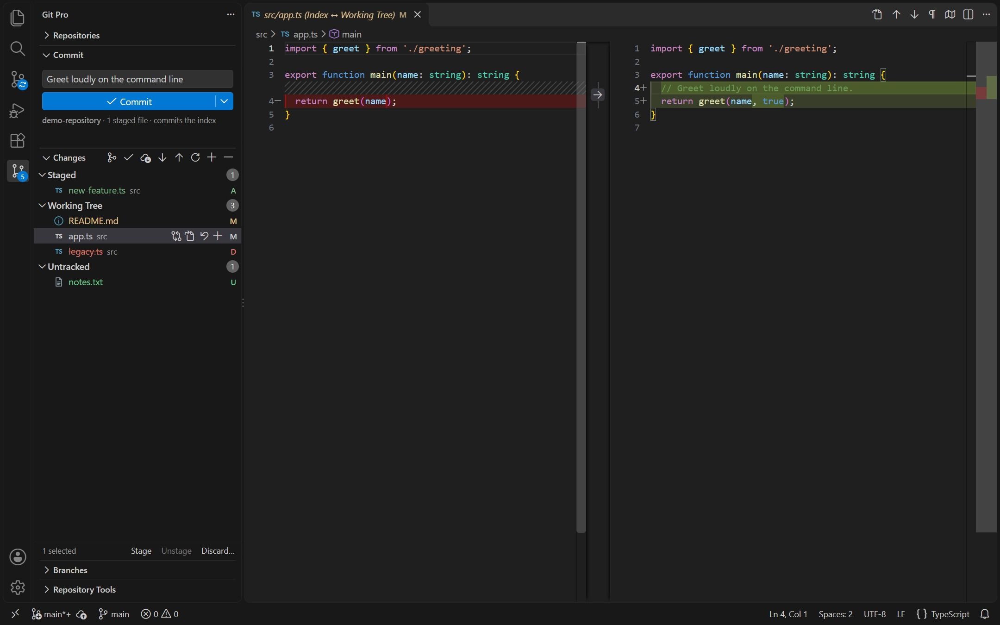
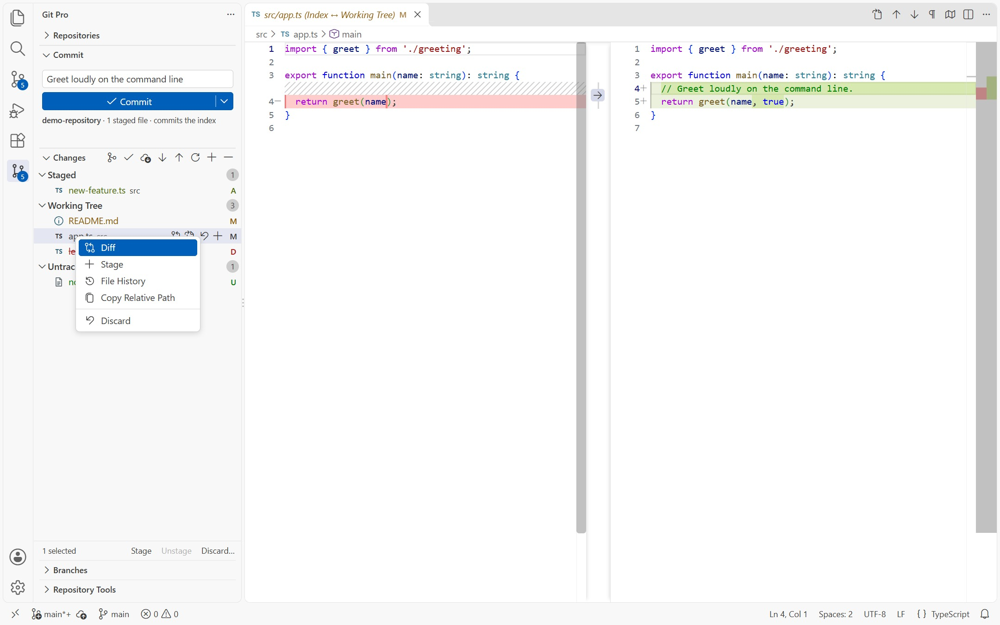
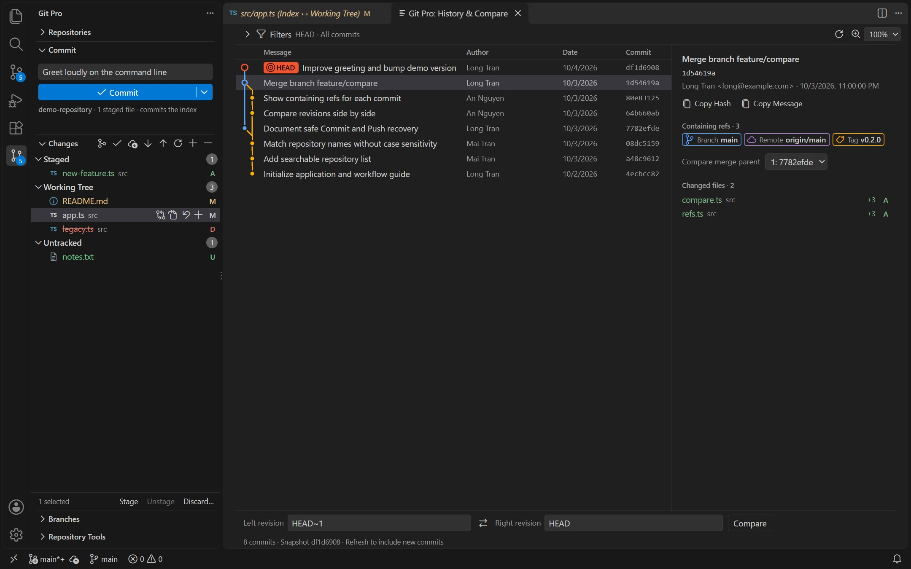

# Git Pro

Git workflows for VS Code: review changes, stage files, write commits, browse History and manage repositories from one sidebar.

**0.1.0 preview.** Behavior and limits may change between versions. See [compatibility and limitations](docs/user-guide/RELEASE_STATUS.md) and report problems on [GitHub Issues](https://github.com/nhech/git-pro/issues).

## See Git Pro in action

Preview screenshots use a demo repository in VS Code with dark and light themes. Layout varies with the VS Code version and window width.

### Review, stage and commit

See staged, modified and untracked files at a glance. Type a message in the Commit box above Changes and press Ctrl+Enter or Commit; the menu beside Commit offers Commit & Push, Amend, Sign-off, Skip hooks and message history.

### File actions where you need them

Hover or select a file for inline Open Changes, Open File, Discard and Stage buttons, or right-click it for its diff, history, staging, relative path and a reviewed discard. Available actions follow the file's state.

### Browse History and compare revisions

Follow the commit graph, select a commit for details and changed files, or compare revisions without leaving VS Code.

## Get started

Requires VS Code 1.100.0 or newer, Git and VS Code's built-in Git extension.

1. Install **Git Pro** from the Extensions view, or run **Extensions: Install from VSIX...** for a downloaded package.
2. Open a trusted repository folder, then select **Git Pro** in the Activity Bar.
3. Review changes, stage the files you want, type a message in the Commit box and press Ctrl+Enter.

Selecting a file does not stage it. The composer commits the current index, including partial staging performed in native Source Control.

## Features

| Area | Workflows |
|---|---|
| Changes and commits | File and folder staging, native diffs, reviewed discard, commit, amend and signoff |
| Branches and sync | Branch and upstream actions, fetch, explicit pull strategy, push, init and clone |
| History | Commit graph, filters, details, merge-parent selection, comparison and rename-aware File History |
| File review | Text hunk actions, saved-file commits and optional active-line blame and CodeLens |
| Advanced operations | Merge, rebase, cherry-pick, revert, reset and operation recovery; interactive linear rebase |
| Repository tools | Stashes, tags, remotes and worktrees |

Hover a row for inline actions or right-click it for all of them. Icons, theme colors and right-aligned status labels distinguish changes. Auto-fetch, blame and CodeLens are off by default.

Read [getting started](docs/user-guide/GETTING_STARTED.md), [workflows and recovery](docs/user-guide/WORKFLOWS.md) and [settings](docs/user-guide/SETTINGS.md).

## License

MIT, copyright 2026 longtd. See `LICENSE` in the source repository or `LICENSE.txt` in the installed package. Third-party attribution is retained in [THIRD_PARTY_NOTICES.txt](THIRD_PARTY_NOTICES.txt).
